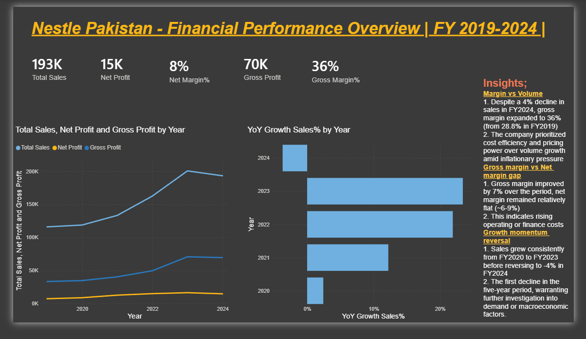
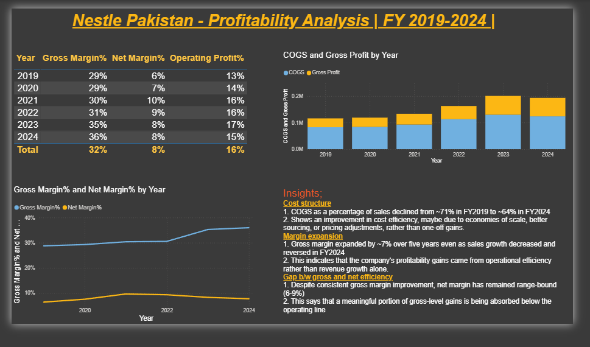
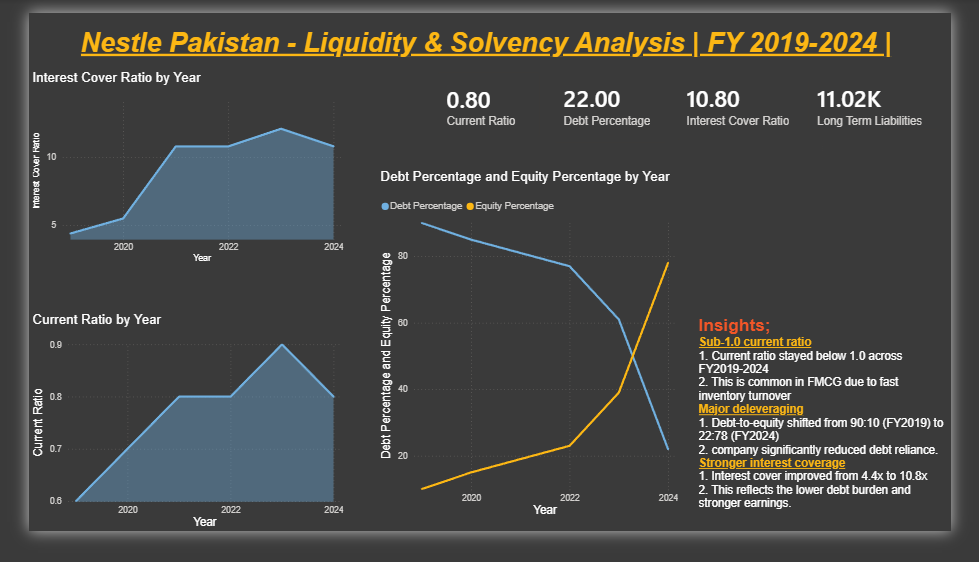
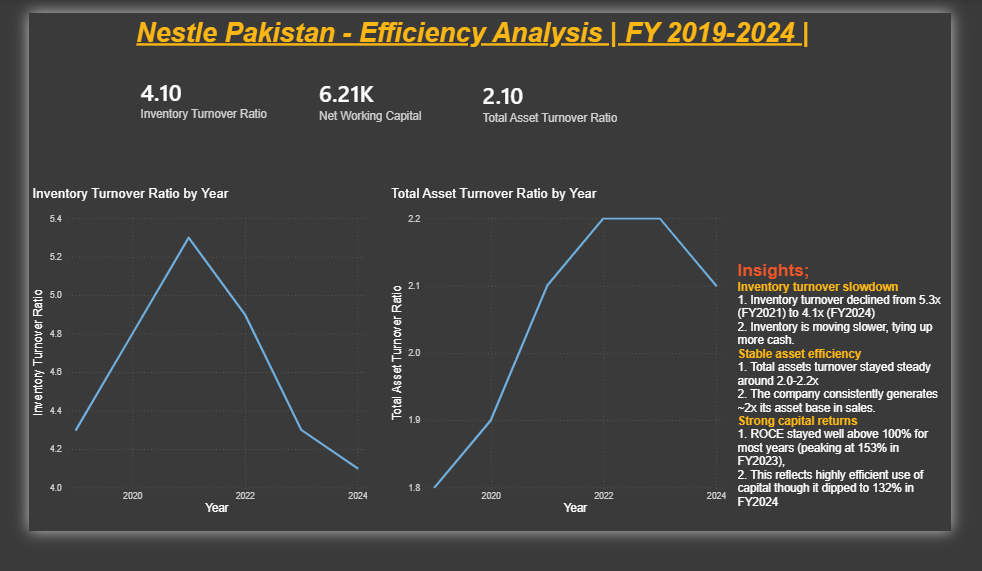

# 📊 Nestle Pakistan - Financial Performance Dashboard (FY2019–2024)

> 🔄 **Update:** A deeper Phase 2(V2) analysis with detailed Balance Sheet, Cash Flow, and Expense breakdowns is now available: [View V2](https://github.com/RikzaRiaz/Nestle-Pakistan-Financial-Dashboard-V2)

An end-to-end Power BI dashboard analyzing Nestle Pakistan's 5-year financial performance, built from the company's annual report six-year financial summary. This project covers Profitability, Liquidity & Solvency, and Efficiency analysis with data-driven insights on each page.

## 🎯 Project Overview

This dashboard was built as a self-directed analytical project to demonstrate financial statement analysis and data visualization skills. Financial data was manually extracted from Nestle Pakistan's PDF annual reports and restructured into a clean, tidy dataset before being modeled in Power BI. It transforms raw annual report data into a structured, interactive Power BI dashboard covering four key analytical areas.

**Data source:** Nestle Pakistan Annual Reports (2019–2024), Six-Year Financial Summary section

**Tool used:** Power BI Desktop (Power Query, DAX, Data Modeling)

## 📁 Dashboard Pages

### 1. Overview
High-level KPIs (Sales, Net Profit, Margins) with year-over-year trends and growth analysis.

### 2. Profitability Analysis
Gross and Net margin trends, cost structure (COGS vs Gross Profit), and profitability insights.

### 3. Liquidity & Solvency Analysis
Current ratio, debt-to-equity shift, and interest coverage trends — assessing the company's short-term liquidity and long-term solvency position.

### 4. Efficiency Analysis
Inventory turnover, total asset turnover, and return on capital employed (ROCE) trends.

## 🔑 Key Insights

- Gross margin expanded from 28.8% (FY2019) to 36.0% (FY2024), driven by cost efficiency rather than volume growth
- Sales declined -3.7% in FY2024, the first decline in the five-year period
- Debt-to-equity structure shifted dramatically from 90:10 (FY2019) to 22:78 (FY2024) - significant deleveraging
- Interest cover improved from 4.4x to 10.8x, reflecting stronger debt-servicing capacity
- ROCE remained above 100% throughout, peaking at 153% in FY2023

## 🛠️ Tools & Techniques Used

- **Power BI Desktop** - data modeling, DAX measures, interactive visuals
- **Power Query** - data cleaning and transformation
- **DAX** - custom measures for YoY growth, margins, and ratio calculations
- **Data Modeling** - star-schema style relationship between Financials and Year dimension tables

## 📂 Repository Contents

| File | Description |
|------|-------------|
| `Nestle Pakistan Dashboard V1.pbix` | Full interactive Power BI file |
| `Nestle Pakistan Dashboard V1.pdf` | Static PDF export of all dashboard pages |
| `Overview.png`, `Profitability.png`, `Liquidity_Solvency.png`, `Efficiency.png` | Page-by-page screenshots |
| `data/RawData_Nestle_6yr_Summary.csv` | Source data extracted and structured from annual reports |

## 🚀 Next Steps (In Progress)

This is Version 1 of the project, built from the annual report's summary financial data. A Phase 2 update is planned, incorporating detailed Balance Sheet, Income Statement, and Cash Flow Statement data to enable deeper working capital, expense-breakdown, and cash flow analysis.

## 👤 About Me

Built by [Rikza Riaz](https://www.linkedin.com/in/rikza-riaz-3236a3374/) as a self-directed project to practice financial analysis and Power BI dashboard development.
